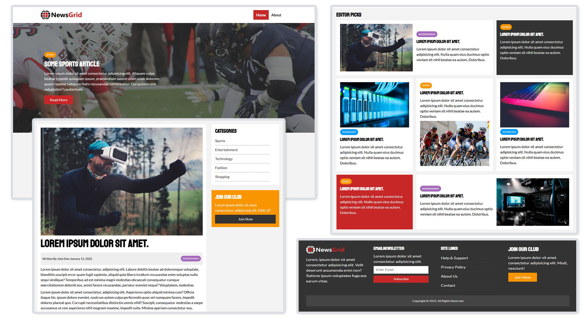

# 💻 NewsGrid - News Website Template

> Built with HTML, CSS Grid & Responsive Media Queries

🌐 [Visit Site](https://randulatharaka.github.io/NewsGrid/){:target="\_blank"}

NewsGrid is a fully responsive news website template
featuring a modern css grid layout, category-based article
organization, and dedicated pages for stories and site
info. Built with clean HTML and CSS, it adapts seamlessly
to both desktop and mobile devices.



## ✨ Features

- **Grid-Based Layout:** Visually appealing grid system for organizing articles and featured content.
- **Responsive Design:** Adapts seamlessly to desktop, tablet, and mobile devices.
- **Category Organization:** Dedicated sections for different news categories.
- **Article & About Pages:** Includes individual article pages and an about section.
- **Clean & Modern UI:** Focused on readability and accessibility.

## 🧩 Project Structure

```
NewsGrid/
├── about.html           # About page
├── article.html         # Article details page
├── favicon.ico          # Site favicon
├── index.html           # Homepage
├── css/
│   ├── mobile.css       # Mobile-specific styles
│   └── style.css        # Main stylesheet
├── img/
│   ├── featured.jpg     # Main featured image
│   ├── icon.png         # Site icon
│   ├── logo_light.png   # Light logo variant
│   ├── logo.png         # Main logo
│   ├── logo.psd         # Logo source file
│   └── articles/
│       ├── ent1.jpg     # Entertainment article image 1
│       ├── ent2.jpg     # Entertainment article image 2
│       ├── sports1.jpg  # Sports article image
│       ├── tech1.jpg    # Tech article image 1
│       └── tech2.jpg    # Tech article image 2
```

## 📦 Installation

1. Clone the repository: git clone https://github.com/RandulaTharaka/NewsGrid.git
2. Open the `NewsGrid` folder in your code editor.
3. Open `index.html` in your web browser to view the homepage.
4. Explore other pages such as `about.html` and `article.html` for additional content.

## 📄 License

This project is open source and available under the [MIT License](LICENSE).

## 🤝 Connect With Me

I'm passionate about building full-stack applications and open to new opportunities in software development.

Feel free to connect or reach out!

[](https://www.linkedin.com/in/randula-tharaka-79a61a145/)
[](mailto:iamrandula@gmail.com)
